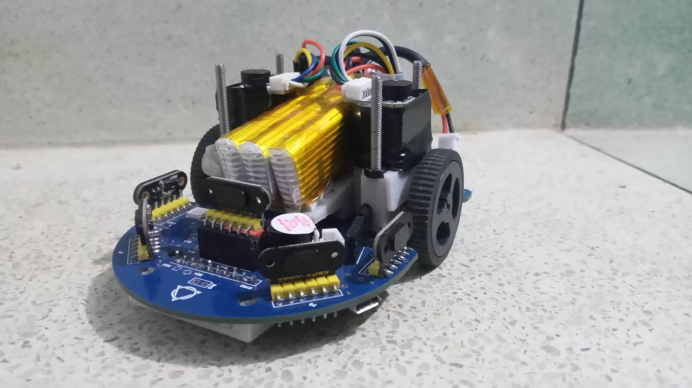
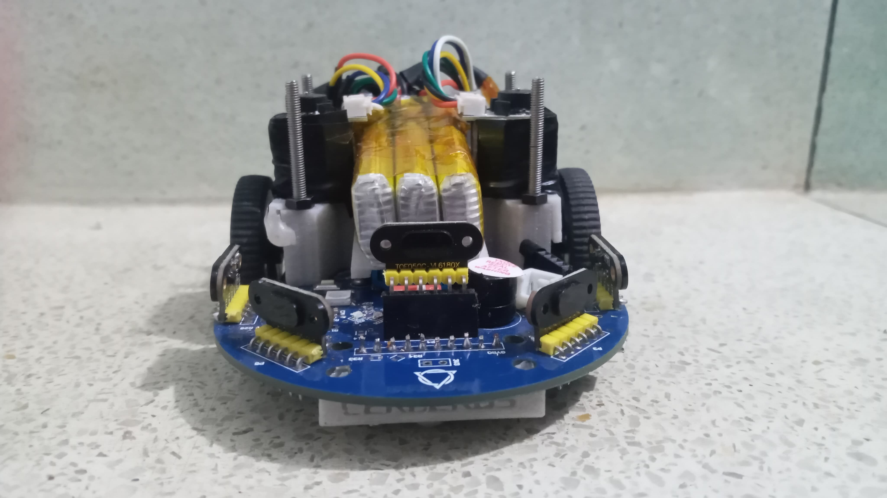
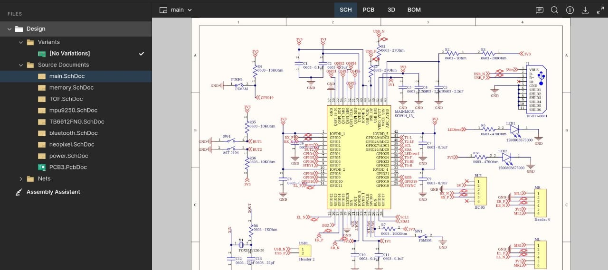
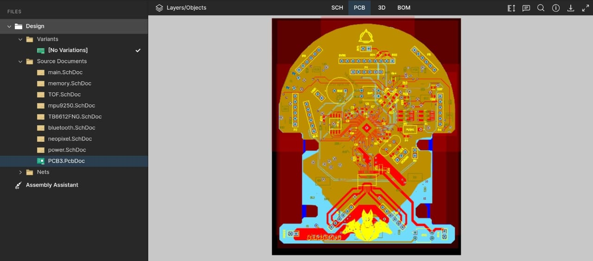
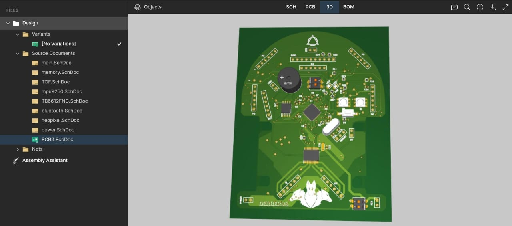

# Cerberus-24 (Micromouse Project using RP2040)

This project involves the design and development of a micromouse robot using the RP2040 microcontroller. The system includes a custom 4-layer PCB design and utilizes 3D-printed components for the physical structure. The micromouse is tuned for efficient cell navigation in maze environments, employing various sensors and motors for precision control.

  <figure>
    
    <figcaption><b>Micromouse Side View</b></figcaption>
  </figure>
  
  <figure>
    
    <figcaption><b>Micromouse Front View</b></figcaption>
  </figure>

  <figure>
    
    <figcaption><b>Micromouse Side View</b></figcaption>
  </figure>
  
  <figure>
    
    <figcaption><b>Micromouse 4- Layer PCB</b></figcaption>
  </figure>

  <figure>
    
    <figcaption><b>Micromouse PCB 3D View</b></figcaption>
  </figure>

</div

## Highlights
- Tuned the micromouse for efficient cell-to-cell navigation, utilizing data from the VL6180X sensors and encoder feedback.
- Designed a stable and responsive PID control system that integrates data from both the ToF sensors and motor encoders.
- 3D-printed components were used to create a lightweight and durable chassis.
  
## Future Improvements
- Further optimization of the PID tuning for even more precise movement.
- Potential upgrades to the sensor array for enhanced environmental awareness.

